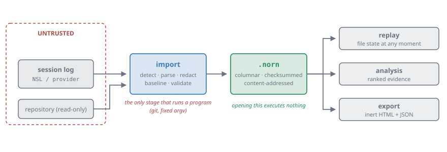
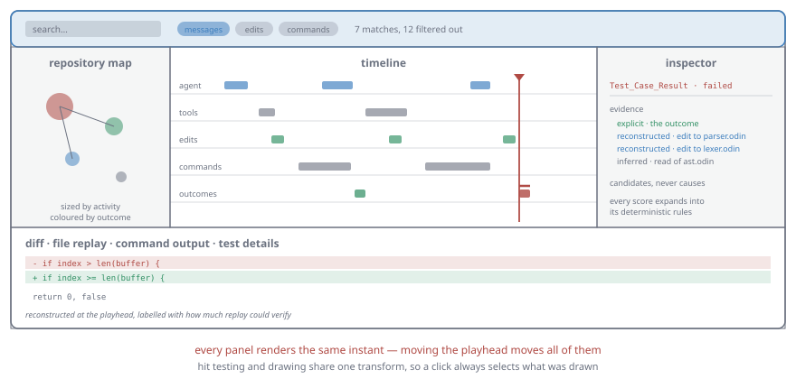
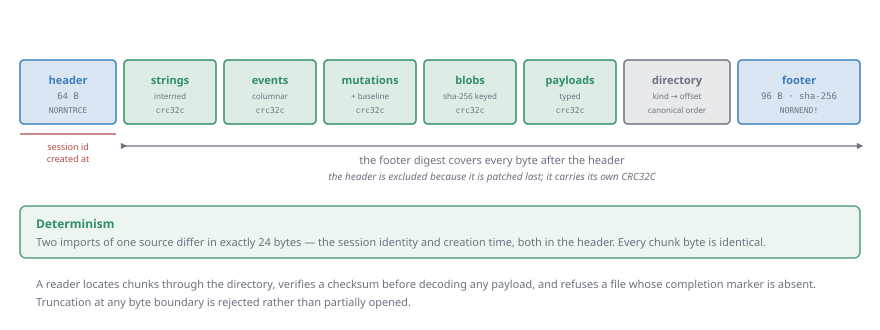

# Norn

**A native time-travel debugger for coding-agent sessions.**

When an agent works on a repository for an hour, it leaves a log: prompts, tool
calls, edits, commands, tests, errors. When something ends up broken, that log
is the only record of how it got that way — and reading it linearly is the worst
possible way to find out.

Norn imports the log into a queryable trace, reconstructs the repository at
every point in the session, and lets you start from the failure and work
backward through the evidence that preceded it.

<p align="center">
  
</p>

## Why it works this way

**A trace is evidence, so it is treated as untrusted.** The log came from a tool
that may have been compromised, and it may have been shared or downloaded.
Opening one executes nothing, writes to no repository, resolves no path outside
the selected root, and fetches no URL. Import is the only stage that runs
another program at all — `git`, with a fixed argument vector built from
validated input.

**Reconstruction is verified or it is labelled a gap.** A patch whose context
does not match exactly is never fuzzy-matched into place; it produces a recorded
gap. Content is shown as verified only when a recorded hash confirms it.
Producing plausible-looking bytes the session never had would be worse than
producing nothing, because nothing about the result would look wrong.

**Analysis ranks candidates and never claims a cause.** Evidence is separated
into explicit, reconstructed, and inferred; every score expands into the
deterministic rules that produced it; and a replay gap visibly caps confidence.
The interface says "candidate contributor," never "the cause."

## What using it looks like

<p align="center">
  
</p>

Select a failing test. The inspector shows the evidence behind it — the outcome,
the edits since the last comparable pass, the reads and tool results tied to
those edits, and ranked candidates with their reasoning. Move the playhead and
every panel follows: the diff shows that file as it stood at that instant, the
map recolours, the timeline scrolls.

Everything is reachable from the keyboard.

## Quick start

```sh
brew install odin sdl3
scripts/bootstrap-graphics.sh          # stb sources + pinned wgpu-native

scripts/norn.sh build
scripts/norn.sh fixture tiny out.jsonl # a generated session log

build/norn import out.jsonl --repo . --out session.norn
build/norn open session.norn
```

`bootstrap-graphics.sh` compiles Odin's vendored stb sources and fetches the
pinned upstream wgpu-native release; Odin ships neither ready to use on macOS,
and the Homebrew wgpu package reports a version its bindings reject. Requires
Odin `dev-2026-07` (pinned in [`.odin-version`](.odin-version)) and the macOS
command-line tools. The CLI alone needs nothing beyond Odin.

## Commands

```sh
norn open     <trace.norn>
norn import   <source> --repo <path> [--format <id>] [--out file.norn] [--dry-run]
norn inspect  <trace.norn> [--json]
norn validate <trace.norn> [--mode quick|full|replay]
norn explain  <trace.norn> --list | --event <id>
norn export   <trace.norn> --out <dir> [--range start:end] [--event <id>]
```

**`import`** converts a session log into a validated trace. It never executes
the source or anything named in it, redacts before writing, captures the
repository baseline so edits to pre-existing files can be replayed, and reports
what it repaired, ignored, or replaced. `--dry-run` reports what a source
contains — including record types no adapter can map — without writing output.

**`open`** launches the desktop application. Arrows step events, Shift steps
mutations, Command steps outcomes; `[` and `]` set a comparison range; `F`
focuses a file; `D` cycles the four diff comparisons; `/` searches; `W` shows
the session's import notes; Escape backs out one layer at a time.

**`explain`** is the diagnosis workflow at the terminal: select a failed outcome
and it prints the ranked evidence behind it, each candidate expanding into the
rules that scored it.

**`export`** writes that evidence as a self-contained HTML report plus canonical
JSON. It prints an inclusion manifest first, and excludes prompt text and raw
provider records by default.

Machine-readable output goes to stdout and diagnostics to stderr, so
`norn inspect --json` pipes cleanly. Exit codes: `0` success, `2` usage,
`3` unreadable input, `4` invalid trace, `5` unsupported feature.

## The trace format

<p align="center">
  
</p>

A `.norn` file is a columnar container: events, entities, mutations, and typed
payloads in parallel arrays rather than a document tree, so a reader can query a
time range without decoding the session. Strings are interned, file content is
content-addressed by SHA-256, and every chunk carries its own checksum verified
before the payload is decoded.

The format is specified in [Trace format](docs/04-trace-format.md).

## Status

The canonical model, container codec, import pipeline, replay engine, evidence
analysis, redacted export, and native UI all work, and the full workflow —
import, validate, replay, diagnose, export — runs end to end.

The significant gap is a **provider adapter**. [Importers](docs/05-importers.md)
requires adapter support to rest on fixtures rather than assumptions, and
pinning a real provider's schema needs real sample traces. Until those exist,
Norn imports [NSL](docs/14-nsl-format.md) — a session-log format it defines and
owns, which exercises every mapping requirement in the adapter contract and
generates the fixture tiers. Annotation overlays and bookmarks are also not
built.

## Repository layout

```text
docs/            product and engineering specification
src/
  core/          checked arithmetic, errors, limits, paths, CRC32C
  main/          CLI entry point and commands
  trace/model/   canonical semantic types, interning, blobs
  trace/codec/   .norn reader, writer, and validator
  replay/        virtual repository, patching, seeking, comparison, diffing
  analysis/      outcomes, comparability, scoring, evidence, attempts, search
  app/           selection, commands, replay session, window, frame loop
  render/        draw lists, primitives, batching, fonts, WGPU backend
  ui/            viewport transforms, virtualization, panels
  export/        bundle assembly, HTML report, canonical JSON
  importers/     adapter contract, record sink, redaction, NSL adapter
  tools/         fixture generator, replay benchmark
tests/           one package per source package, plus hostile fixtures
scripts/         build, test, security gate, fixtures, benchmarks
```

Dependencies flow inward toward `trace/model`; circular package dependencies are
prohibited.

## Safety properties

Enforced in code and covered by tests, not merely documented:

- opening a trace executes nothing and writes to no repository;
- every length and offset from untrusted input is overflow-checked before use;
- recorded paths must normalize to repository-relative form, and `..` is never
  resolved against an earlier component;
- checksums are verified before any structured payload is decoded, and an
  unfinalized or truncated file is refused rather than partially opened;
- exports declare a restrictive content security policy, contain no script
  element, and reference no remote resource, so trace content renders as text;
- redaction runs before the writer, so a secret never reaches the artifact.

Two more are worth naming because they are easy to lose in a refactor. Hit
testing and drawing share a single transform, so a click always selects what was
drawn. And patch application is strict: reconstructing a file at the wrong
offset would produce bytes the session never had, and nothing about the result
would look wrong.

## Testing

```sh
scripts/norn.sh test
```

559 tests across eleven packages, plus 49 CLI contract checks, 122 security
checks, and 5 fixture-determinism checks. The security gate runs every fixture in `tests/fixtures/hostile` through
the built binary and asserts outcomes rather than mechanisms: no sentinel file
was created, the repository hash is unchanged, no export leaked a secret or
produced active markup, memory stayed bounded. It found a buffer overflow in
JSON string decoding on its first run.

Fixture provenance and the expected hashes are in
[tests/fixtures](tests/fixtures/README.md). See
[Quality](docs/09-quality.md) for the test layers and release gates, and
[Engineering notes](docs/13-engineering-notes.md) for measurements and the
mistakes behind them.

## License and reporting

MIT — see [LICENSE](LICENSE). Third-party attributions are in
[NOTICE.md](NOTICE.md), which must ship with any binary release.

Security problems go through
[private advisories](https://github.com/arcbjorn/norn/security/advisories/new),
never a public issue, and never with an unredacted trace attached — see
[SECURITY.md](SECURITY.md).

## Documentation

The full specification is in [`docs/`](docs/README.md). Start with
[Product](docs/00-product.md) for scope and
[Architecture](docs/02-architecture.md) for structure. The documents are
normative: where this README and a specification disagree, the specification is
correct.
